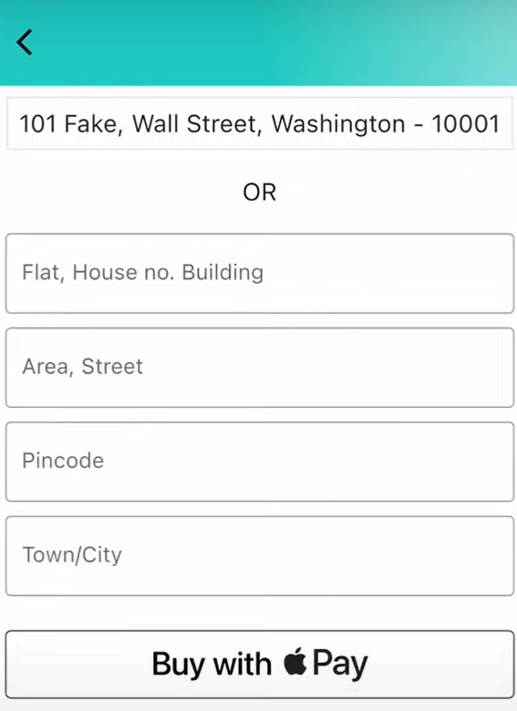
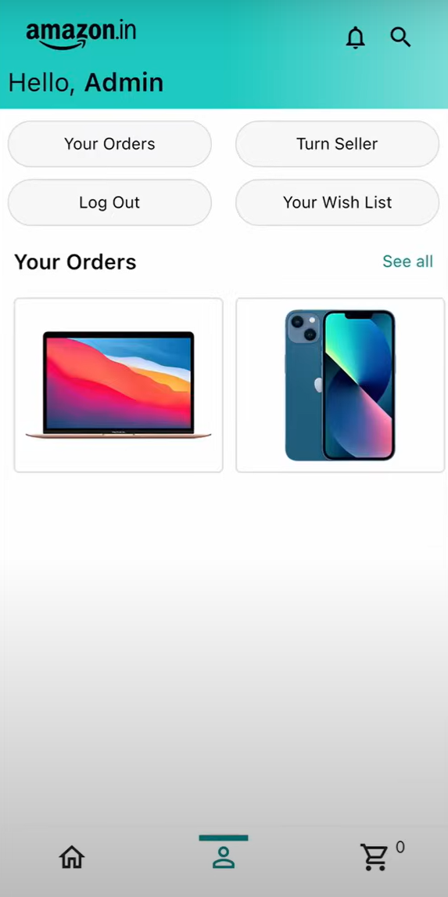
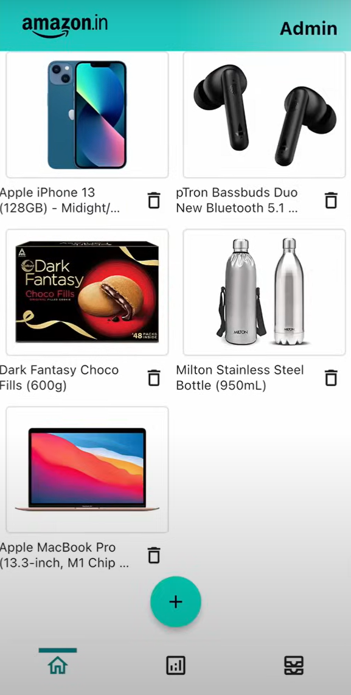
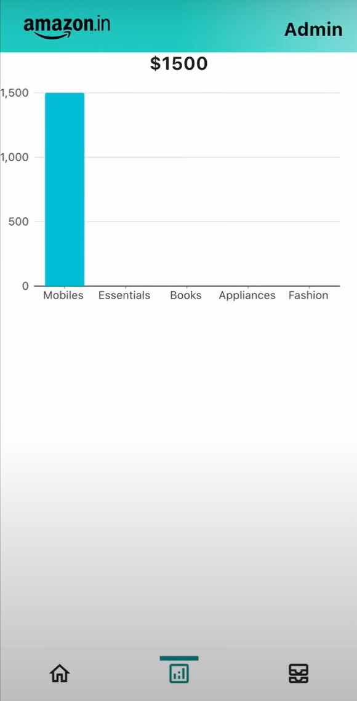
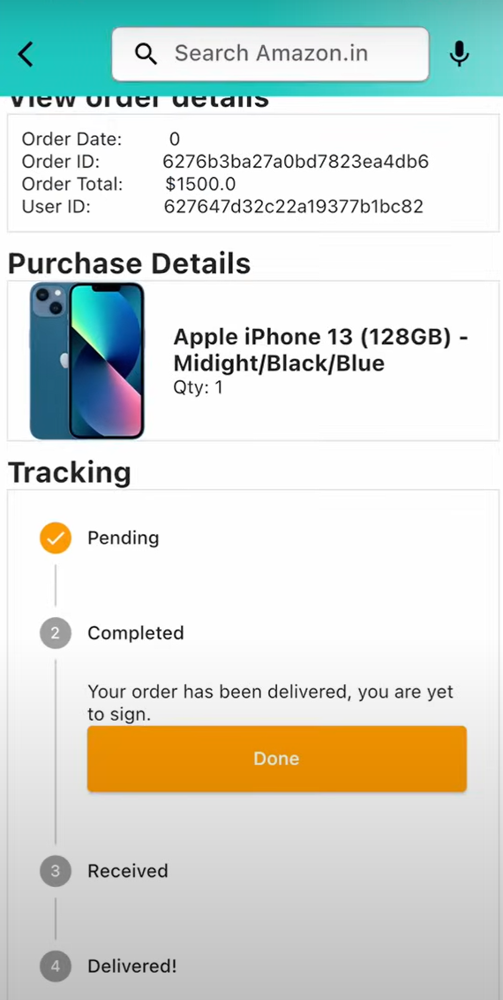

# eCommerce app

Full Stack eCommerce app along with Admin Panel

## Features
- Email & Password Authentication
- Persisting Auth State
- Searching Products
- Filtering Products (Based on Category)
- Product Details
- Rating
- Getting Deal of the Day
- Cart
- Checking out with Google/Apple Pay
- Viewing My Orders
- Viewing Order Details & Status
- Sign Out
- Admin Panel
    - Viewing All Products
    - Adding Products
    - Deleting Products
    - Viewing Orders
    - Changing Order Status
    - Viewing Total Earnings
    - Viewing Category Based Earnings (on Graph)
 

## Screenshots

<p align="center">
   
   
   
</p>

<p align="center">
   
   
   
</p>

<p align="center">
   
   
   
</p>

<p align="center">
   
</p>


## Running Locally
After cloning this repository, migrate to ```flutter-ecommerce-app-tutorial``` folder. Then, follow the following steps:
- Create MongoDB Project & Cluster
- Click on Connect, follow the process where you will get the uri.- Replace the MongoDB uri with yours in ```server/index.js```.
- Head to ```lib/constants/global_variables.dart``` file, replace <yourip> with your IP Address. 
- Create Cloudinary Project, enable unsigned operation in settings.
- Head to ```lib/features/admin/services/admin_services.dart```, replace ```denfgaxvg``` and ```uszbstnu``` with your Cloud Name and Upload Preset respectively.

Then run the following commands to run your app:

### Server Side
```bash
  cd server
  npm install
  npm run dev (for continuous development)
  OR
  npm start (to run script 1 time)
```

### Client Side
```bash
  flutter pub get
  open -a simulator (to get iOS Simulator)
  flutter run
```

## Tech Used
**Server**: Node.js, Express, Mongoose, MongoDB, Cloudinary

**Client**: Flutter, Provider
    
## Feedback

If you have any feedback, please reach out to me at navgarg9548@gmail.com
